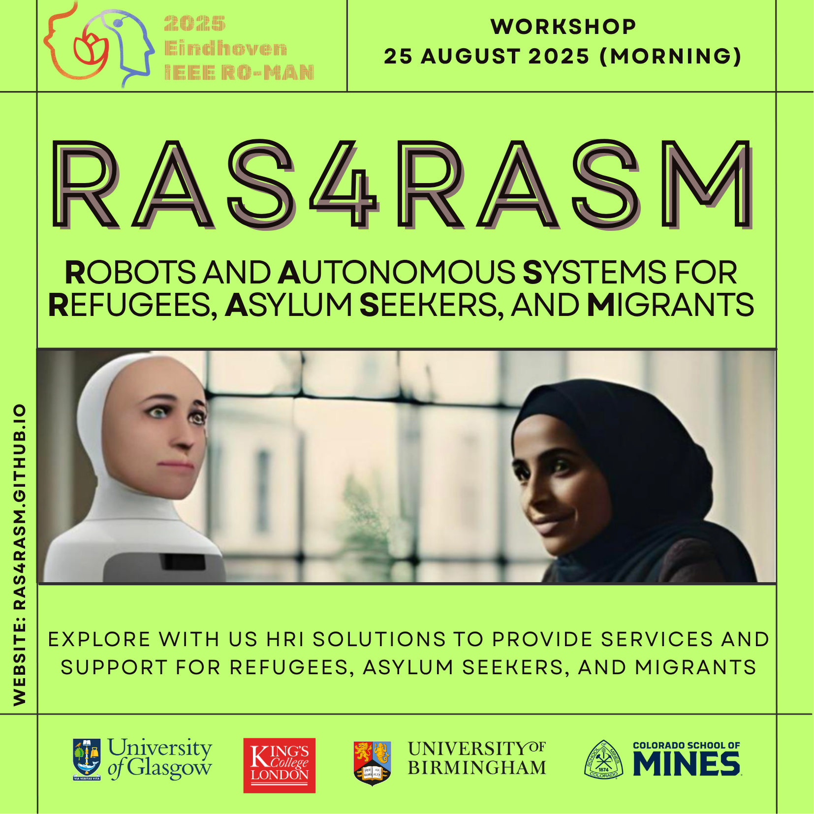

## RAS4RASM: The 1st international workshop on Robots and Autonomous Systems for Refugees, Asylum Seekers, and Migrants | RO-MAN 2025

[//]: # (In this workshop, we will explore HRI solutions to provide services and support for refugees, asylum seekers, and migrants. We will also discuss the ethical issues behind the use of robots for these populations, potential lessons learned from existing work, and work towards HRI that contributes to communities feeling more at home and welcome as they navigate their way in their new countries.)

[Workshop website](https://ras4rasm.github.io/)